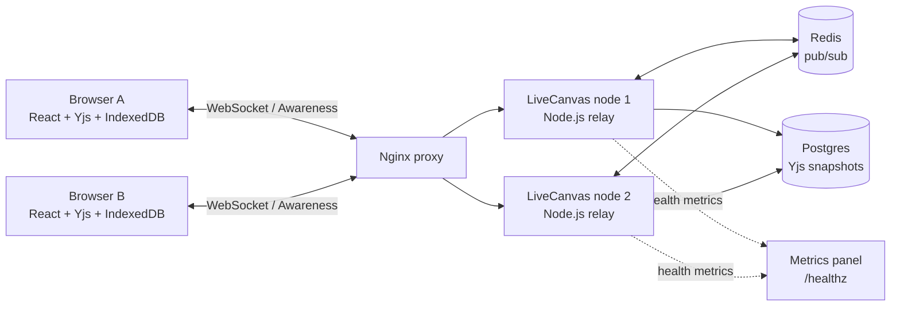

# LiveCanvas

LiveCanvas is a self-hosted, local-first collaborative whiteboard. It is a compact systems demo for conflict-free editing: people can draw together, lose their connection, reconnect, and converge on the same board without a hosted realtime vendor.

## Highlights

- Real-time sticky notes, shapes, freehand drawing, selection, drag, and synced undo/redo.
- Yjs CRDT document state with live Awareness cursors and collaborator presence.
- IndexedDB persistence for offline-first edits and automatic reconnection/merge.
- Postgres room snapshots for durable recovery after a service restart.
- Redis pub/sub for cross-node Yjs fan-out; run multiple Node replicas behind Nginx.
- In-app Metrics panel and `/healthz` endpoint for connection, update, relay-latency, and snapshot-write telemetry.

## Quick start

Prerequisite: Docker Desktop.

```bash
docker compose up --build --scale livecanvas=2
```

Open [http://localhost:3001](http://localhost:3001) in two browser windows. Draw in one window, then watch the second update. Click **Metrics** to show the active node, Redis status, connections, Yjs updates, snapshot duration, and IndexedDB state.

Stop the stack with:

```bash
docker compose down
```

## Architecture



### Request and state flow

1. The browser edits a Yjs `shapeMap`; the local document is persisted to IndexedDB.
2. The WebSocket relay broadcasts the Yjs update to local clients and publishes it to Redis.
3. Other Node replicas receive the Redis message and broadcast the same update to their connected clients.
4. Each replica debounces a complete Yjs update into a Postgres room snapshot.
5. The client polls `/healthz` to render its Metrics panel. The endpoint exposes per-replica metrics.

## Tech stack

| Layer | Choice | Why it is here |
| --- | --- | --- |
| Editor | React + TypeScript + Vite | Fast, typed interactive canvas UI. |
| Conflict-free sync | Yjs + `y-websocket` | Concurrent edits converge without a central edit lock. |
| Offline cache | `y-indexeddb` | Local board state survives refreshes and reconnects. |
| Realtime service | Node.js + `ws` | Small custom relay for Yjs sync and Awareness messages. |
| Cross-node fan-out | Redis pub/sub | Lets multiple relays serve one board. |
| Durability | Postgres | Stores the latest compacted update per board room. |
| Edge proxy | Nginx | Routes HTTP/WebSocket traffic to Node replicas. |
| Runtime | Docker Compose | Reproducible local demo with one command. |

## Metrics and observability

Click **Metrics** in the app to expose the demo telemetry. It displays:

- Redis connection status and the serving node ID.
- Live WebSocket connection count and Yjs update count.
- Redis relay latency for updates arriving from another node.
- Most recent Postgres snapshot duration.
- IndexedDB cache readiness in the browser.

The same data is available as JSON:

```bash
curl http://localhost:3001/healthz
```

Server logs are JSON events for `client_connected`, `client_disconnected`, `snapshot_saved`, and Redis failures:

```bash
docker compose logs -f livecanvas
```

## Demo script

1. Start two replicas: `docker compose up --build --scale livecanvas=2`.
2. Open the board in two windows; draw a line and move a sticky note.
3. Open **Metrics** and show the Yjs update count and snapshot time change.
4. Disable your network briefly, add a note, then reconnect. IndexedDB retains the local update and Yjs merges it back into the room.
5. For an extra scalability proof, keep both windows open while showing `docker compose ps` with two `livecanvas` containers.

## Development and checks

```bash
npm install
npm run check
npm run build
npm run test:realtime
```

`test:realtime` opens two Yjs clients and asserts an update arrives at the second client.

## Project layout

```text
apps/web/       React canvas and collaboration client
apps/server/    Yjs WebSocket relay, Redis fan-out, snapshots, /healthz
tests/          Lightweight real-time regression probe
compose.yaml    Node replicas, Nginx, Redis, and Postgres
```

## Demo assets

The `demo/` directory is ignored so personal recordings are not committed accidentally. Capture a board screenshot and a 15–25 second collaboration recording after starting the stack.
